# Sphinx 协作开发

文档代码化开发的一大优势就是便于引入 Git 进行版本管理和协同开发，本节向大家介绍使用 GitHub 平台进行 Sphinx 项目团队协作的流程和方法。

## Github 快速上手

**Github** 是一个基于 **Git** （一个开源的分布式版本控制系统）的版本控制和协作的代码托管平台，因为只支持 git 作为唯一的版本库格式进行托管，因此得名 Github。使用 Github 只需要利用邮箱注册账户，访问 https://github.com 或下载 Github Desktop 既可。将 Github 作为一个协作开发工具，能够使团队工作更有效率，具有更高的生产力。

本教程将以 Github Desktop （目前仅支持支持Windows和macOS两个平台）为例，带同学们学习一些 Github 的基础操作。

### 安装 Github Desktop

#### 注册 Github 账号

使用 GitHub Desktop 需要一个 GitHub.com 或 GitHub Enterprise 帐户，注册流程不再赘述，建议大家使用自己比较常用的邮箱地址注册账号，私人计划 (personal plan)可选择免费计划或付费计划，曾经免费用户只能创建开源仓库，但在GitHub 在被 Microsoft 收购后私有仓库已经可以免费使用了。

#### Github Desktop 下载以及快速入门

GitHub Desktop 官网： <https://desktop.github.com/>

根据自己的操作系统安装相应的 GitHub Desktop 版本，以下操作均基于GitHub Desktop for Windows (64bit) 版（GitHub Desktop 无法在32位Windows系统下工作），安装完成后需要登录到 GitHub 帐户，之后是“Configure Git（配置 Git）”步骤，用于设置名称和电子邮件地址。为确保提交正确到你的GitHub 帐户上， 这里需要填写 GitHub 帐户关联的电子邮件地址（但如果同学们希望将自己的邮箱保密，可以使用 GitHub 提供的“no-reply（无需回复）”电子邮件地址， 默认为 [ID+username@users.noreply.github.com](mailto:ID+username@users.noreply.github.com) ）。

然后，同学们会看到 GitHub Desktop 的主界面，让我们从 **Create a tutorial repository and clone it** 开始快速创建第一个Git仓库！

**提示**：为减少设置开发环境的时间，建议同学们安装 Visual Studio Code 并将其作为 GitHub Desktop 的默认文本编辑器，并将 GitHub Desktop 的默认 Shell 设置为 PowerShell（或 Git Bash，如果同学们已经安装了Git SCM的话），这些可以在 File-Options-Advanced 中找到，本教程会在后面提到两者的使用。

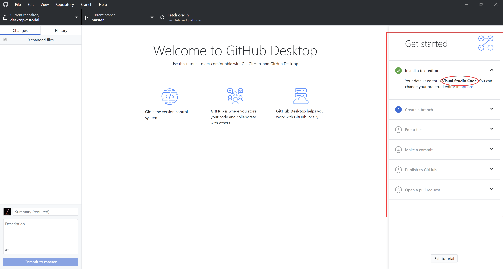

### 仓库创建与管理

单击 **Create a New Repository on your Hard Drive…** （在硬盘上创建新仓库…）

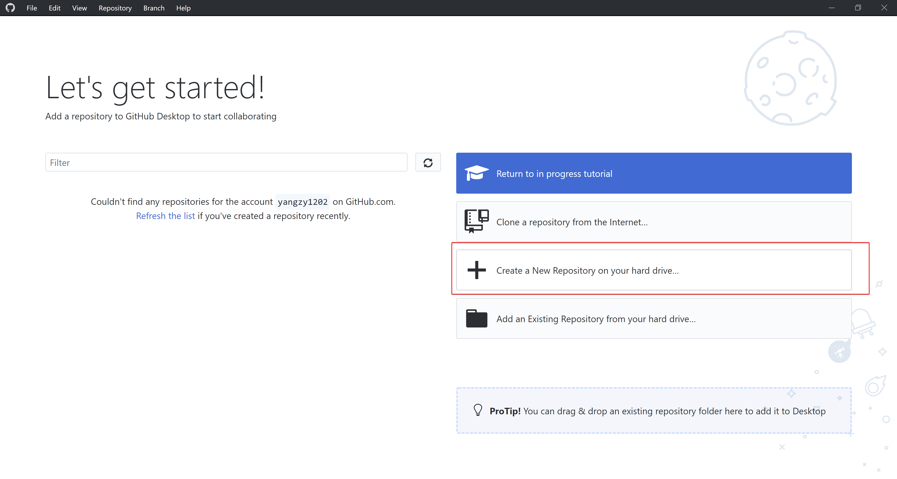

之后可以看到一个设置面板，填写好相关字段后单击 **Create repository** 即可创建本地仓库。

-   “Name” （名称）定义仓库在本地以及 GitHub 上的名称。
-   “Description”（说明） 是一个可选字段，可用于提供有关仓库目的的更多信息。
-   “Local path” （本地路径）设置仓库在计算机上的位置。
-   **Initialize this repository with a README** （使用自述文件初始化此仓库）创建包含 README.md 文件的初始提交。自述文件帮助了解项目的目的，因此建议选择此选项并加入有用的信息。
-   **Git ignore** （Git 忽略）下拉菜单可添加自定义文件，以忽略本地仓库中不想存储在版本控制中的特定文件。如有要使用的特定语言或框架，可以从可用的列表中选择选项。如果刚刚开始学习使用 Github，可跳过此选择。
-   **License** （许可证）下拉菜单可将开源许可证添加到仓库中的 LICENSE 文件。

接着，让我们来认识一下 "Lean-Git" 仓库的 **管理界面**：

1.  菜单下方的栏显示了 GitHub Desktop 中仓库的当前状态：

-   **Current repository：** （当前仓库）目前正在处理的仓库的名称。可以单击 **Current repository** 切换到 GitHub Desktop 中的不同仓库。
-   **Current branch：** （当前分支）目前正在处理的分支的名称。 可以单击 **Current branch** 来查看仓库中的所有分支、切换到不同的分支或者创建新分支。在仓库中创建拉取请求后，也可单击 **Current branch** 查看。
-   **Publish repository：** （发布仓库）目前我们的 “Learn-Git” 仓库只存在于同学们自己的计算机中，同学们是唯一能访问该仓库的人。将仓库发布到 GitHub 可使其在多个处理同一项目的计算机和团队成员之间保持同步。

2.  在左侧边栏中，你可以看到 **Changes** （更改）和 **History** （历史记录）视图。

-   **Changes** 视图显示同学们对当前分支中的文件已经做出但尚未提交到本地仓库的更改。在底部，同学们还能看到 “Summary”（摘要）框和“Description”（说明）文本框，以及 **Commit to master** （提交到 master）按钮。此操作是提交新更改的位置。 **Commit** （提交）按钮指示要将更改提交到哪个分支。

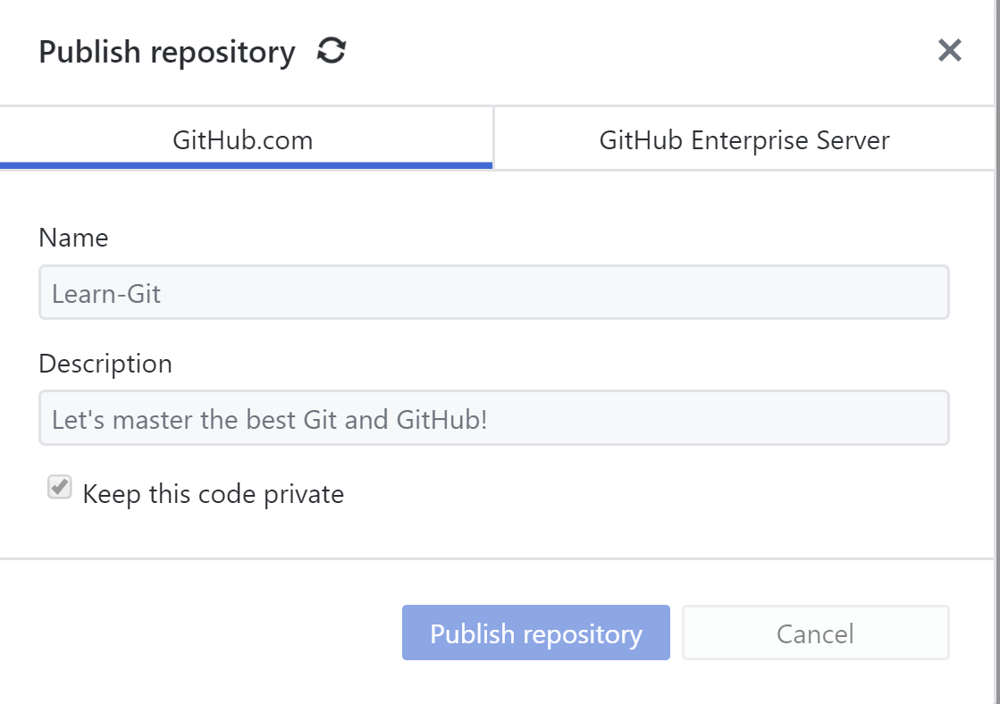

-   **History** （历史记录）视图显示仓库当前分支上以前的提交。同学们应会看到在创建仓库时 GitHub Desktop 所创建的“初始提交”。可以单击每个文件以查看该文件的差异，也就是提交中对该文件的更改。差异只显示文件已更改的部分，而不显示文件的全部内容。

3.  将仓库推送到 GitHub，这样我们也能在 GitHub.com 上对仓库进行修改了。

-   单击 **Publish repository** （发布仓库）

-   同学们会看到 “Name”（名称）和 “Description”（说明）与创建仓库时完成的字段匹配，此外还有一个选项 **Keep this code private** （保留此代码为私有），如果不想与 GitHub 的其他用户公开分享代码，可选择此选项，然后单击 **Publish repository**，即可发布仓库。

-   同学们可以从 GitHub Desktop 访问 GitHub.com 上的仓库。在文件菜单中，单击 **Repository** （仓库），然后单击 **View on GitHub** （在 GitHub 上查看），即可直接在默认浏览器中打开仓库。

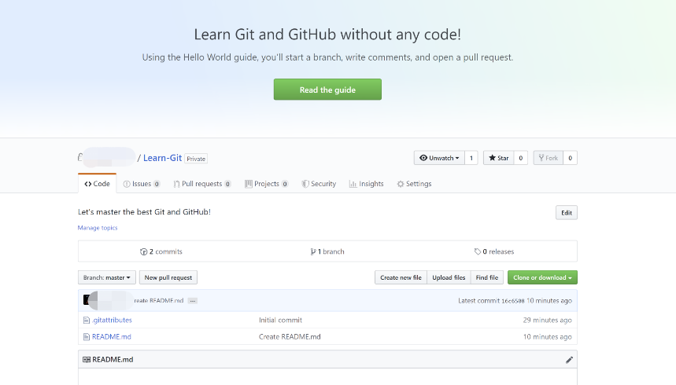

接下来，同学们就可以对于自己的仓库进行提交和推送更改了！

**提示:** GitHub Desktop 中的大多数操作也有对应的快捷键，掌握一些常用的快捷键有助于提高工作效率。 关键盘快捷键的完整列表，请参阅 [GitHub Desktop 中的键盘快捷键](https://help.github.com/desktop/getting-started-with-github-desktop/keyboard-shortcuts-in-github-desktop)。

## Github 协作开发

Github 支持多人协作开发的三种模式：

### fork

此种模式下，开发者 fork 自己生成一个独立的分支，跟主分支完全独立，pull 代码后，项目维护者可根据代码质量决定是否 merge 代码。如果同学们想参与开发某个开源项目，可以将这个项目 fork 到自己的仓库中，此操作会创建一份完全相同的项目到自己的仓库中，也可以 clone 到本地，参与开发，但是对 fork 的项目进行的修改内容并不会影响原本的仓库。如果同学们在原仓库的基础上有修改，可以向原仓库提出 pull request 申请，请求 merge，原仓库的管理者会收到系统的消息提示，决定是否将修改合并到原仓库。

值得注意的是，fork 这种协作方式下，每个成员在开发时都是独立的，可以自行对项目的某一部分进行修改，之后请求合并，但将分支合并的时候，比较容易出现冲突，导致 merge 无法自动完成，最终必须手动处理这些冲突。所以同学们在 fork 模式下进行协作开发的时候，分工一定要明确，不能让两个人都对一个文件进行操作。

*具体操作*

进入 Repo，点击仓库右上角的 fork，还可以将项目克隆到本地。

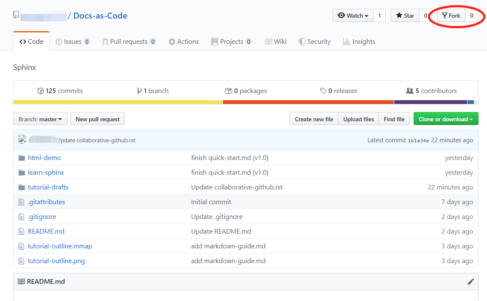

### collaborator
此种模式下，代码仓库的所有者可以为单个仓库增加具备读写权限的合作者。被添加进来的成员就拥有了对该仓库的读写权限，可以将该仓库 clone 到本地进行开发，也同样拥有向该仓库远程提交的权限，但是该仓库不会出现在合作开发者的仓库中。每个合作者都能看到代码库页面访问状态的变化。

本教程的开发最早是基于此种模式，后来为了教程资产管理的方便，转而基于 organization 模式，在 organization 部分会做详细阐述。

*具体操作*

进入 Repo，点击 Settings-> Collaborators-> Add collaborator 即可邀请，被邀请者需要在邮箱中进行确认。

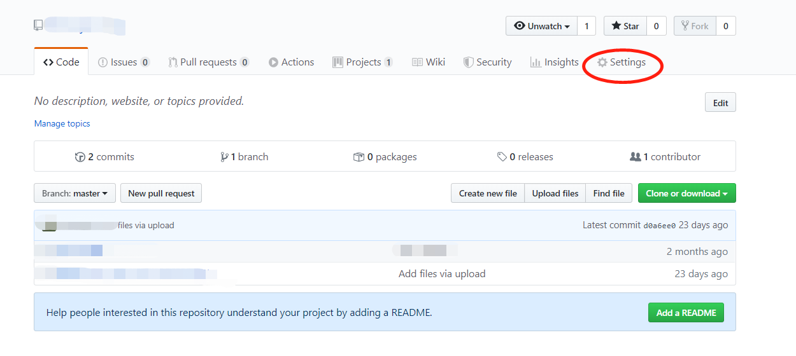

在设置中通过邮箱或用户名添加合作者

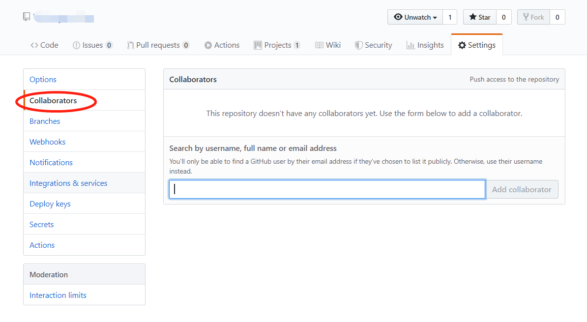

### organization
此种模式下，组织的所有者可以针对不同的代码仓库建立不同访问权限的团队。如果需要为监管的几个团队设置不同的权限级别，或者为不同的代码仓库增加不同的成员，希望项目既有 collaborator 同时又可以限制他们的读写权利，尤其是限制其“写”的权利，可利用 organization 来为成员赋予不同等级的权力。

*具体操作*

组织是非登录账号，不能像创建普通登录账号那样直接创建，而是需要以 GitHub 用户身份登录，然后再创建组织，创建者自然成为组的管理者。所以首先项目团队中需要一个人登入 Github 创建一个组织账号。

1.  进入 Github 点击个人头像，选择 Settings。

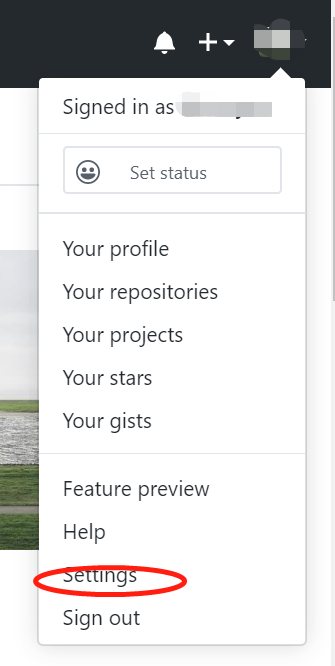

2.  Organization-\> New Organization。

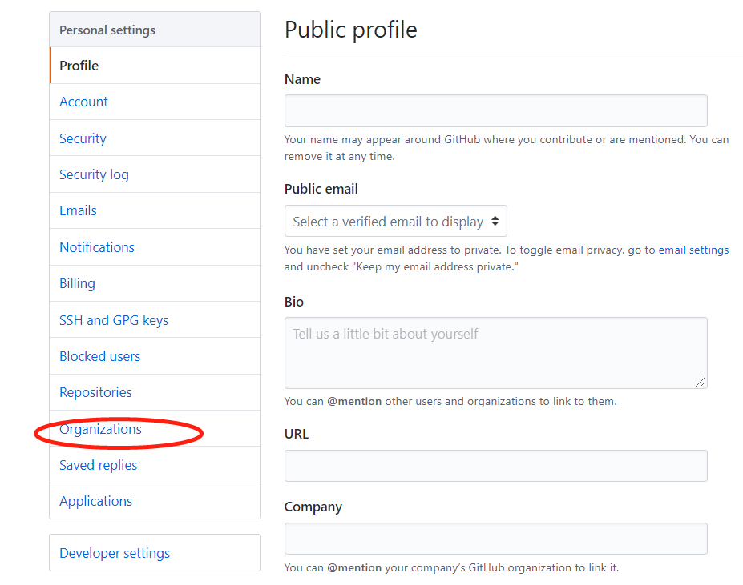

3.  为组织选择合适的计划（免费还是不同级别的付费），默认会选择免费的没有私有版本库的开源方案。

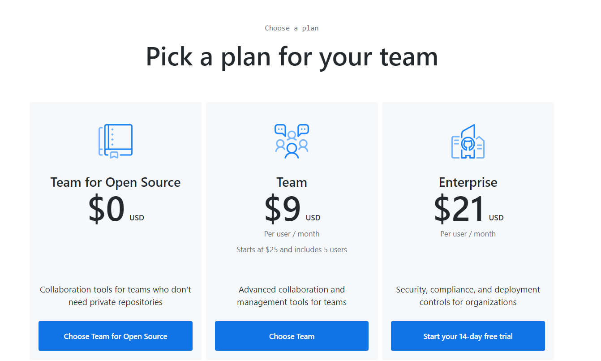

4.  填写组织相关信息。

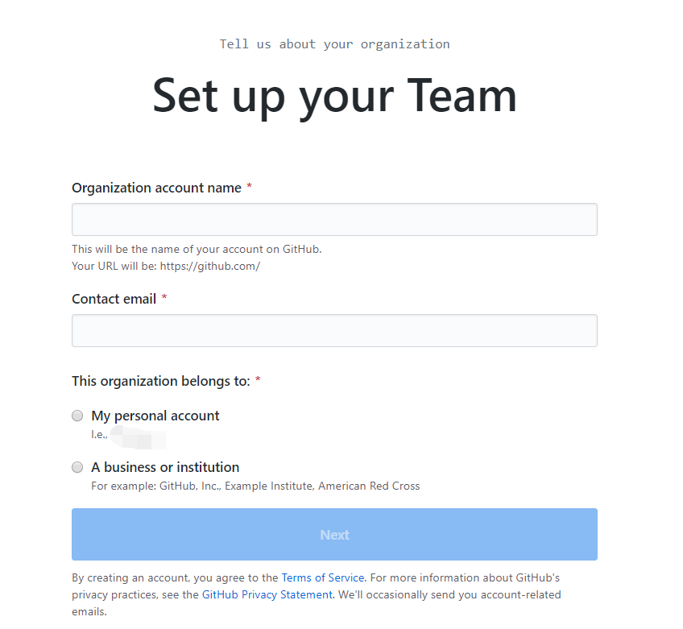

5.  为组织添加成员。

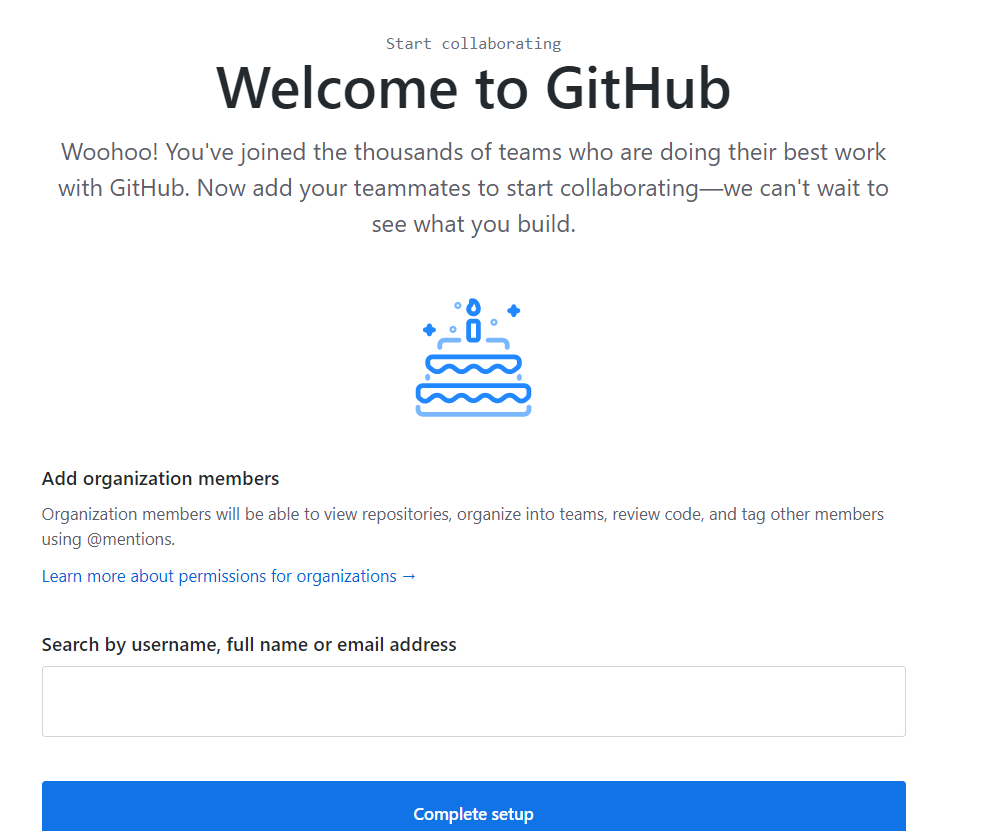

6.  为新建组织设定拥有者（Owner），当前用户，即正在创建组织的用户是组织拥有者之一，用户还可以为组织指派更多的组织拥有者，多个组织拥有者的权限并无差别，都可以管理组织，甚至可以将其他用户从拥有者团队中删除。

7.  设置组员权限。在项目主页([https://github.com/组名)找到](https://github.com/组名)找到)
    Settings-\>Member privileges 进行设置。默认情况下组员是没有权限进行
    push 操作的,把 Default repository permission 设置为 Write 保存即可
    ,这样组员就可以对仓库文件进行 push 操作了。

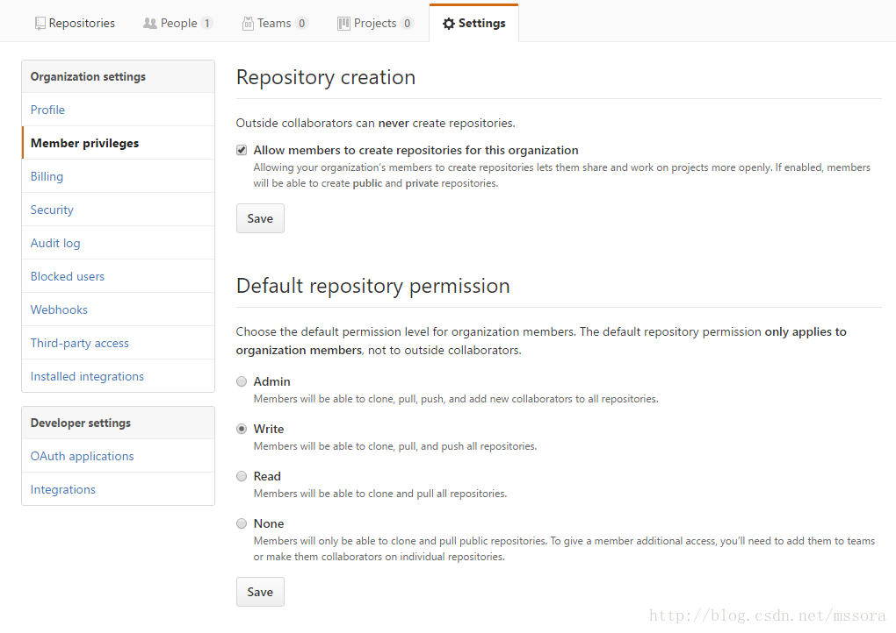

如果需要项目团队中的每一个人都可以管理当前的项目资产，拥有同样的等级权限，organization 模式便是最佳选择，编写本教程过程中也是考虑到资产管理和使用的方便，将协作模式由 collaborator 转为了 organization。

**提示**：GitHub 提供了由个人账号向组织账号迁移的途径。但需要注意的是，个人账号一旦转换为组织账号，无法还原。删除后，所有的项目也会随之删除。

同学们加入组织成为拥有者后，可在个人主页看到组织，并且可以由个人账户切换到组织账户。

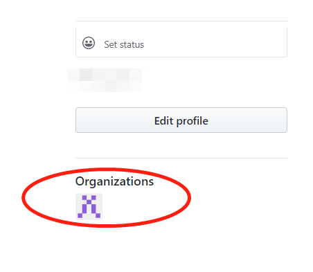

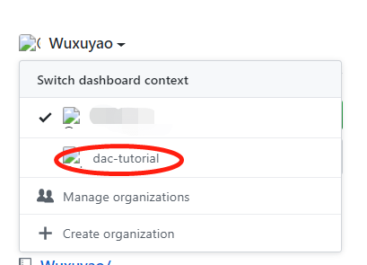

同学们还可以对当前加入的组织进行管理，可以选择离开当前组织。

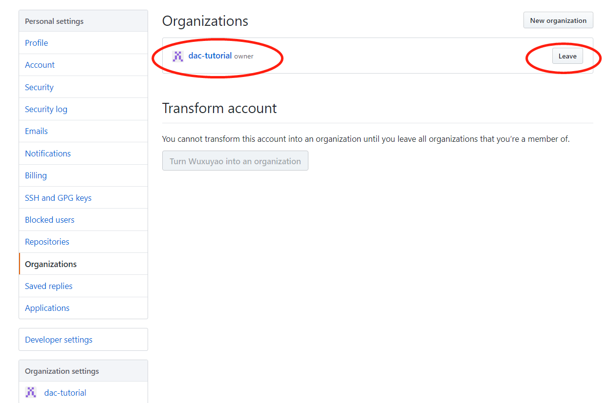

开发者在这三种模式下的权限依次为 fork \< organization \< collaborator。
