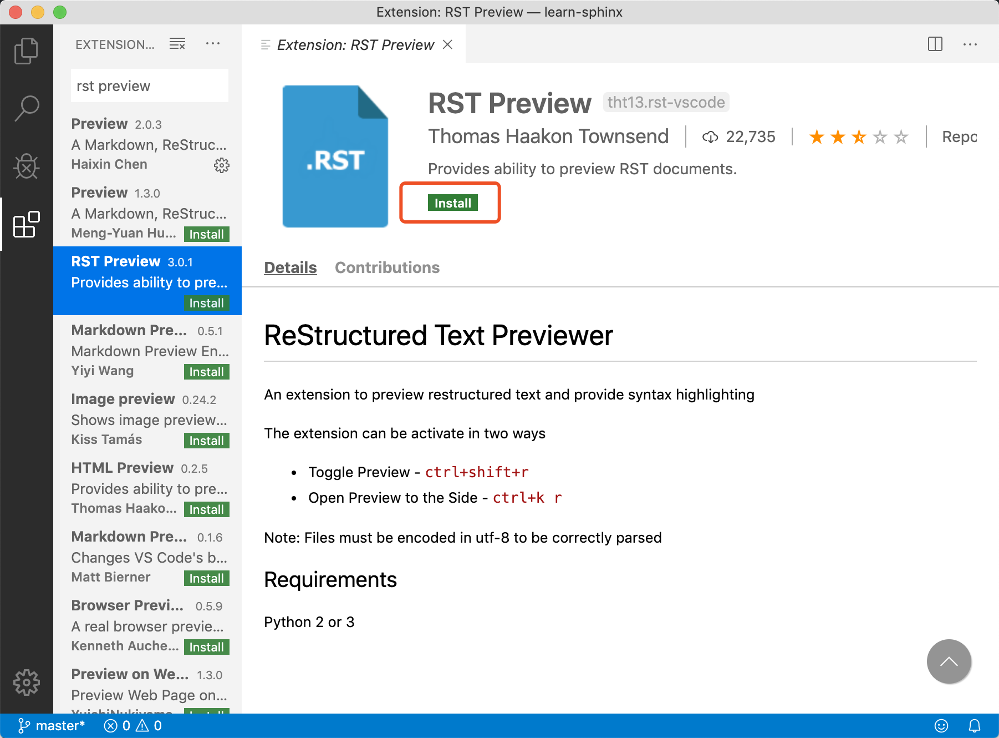

# ReST 语法指南

## ReST 简介

reStructuredText（可简写为RST、ReST或reST）是一种用于文本数据的文件格式，主要用于 Python 编程语言社区的技术文档。 它是Python Doc-SIG（Documentation Special Interest Group）的 Docutils 项目的一部分，旨在为 Python 创建一组类似于 Java 的 Javadoc 或 Perl 的 Plain Old Documentation（pod）的工具。Docutils 可以从 Python 程序中提取注释和信息，并将它们格式化为各种形式的程序文档。

reStructuredText 是一种轻量级标记语言，其设计目的是（a）文档处理软件（如 Docutils）可以处理它，（b）读和写 Python 源代码的程序员很容易读它。本教程介绍的 Sphinx，则是从 reStructuredText 文档生成 HTML/PDF 的工具。

学习本章 reStructuredText 语法，首先要理解两种标记元素：指令（Directives）和角色（Role）。区别在于指令是块级元素，像段落一样使用。角色是行内元素，可以写在普通文本之中。

在教程第一小节的 Sphinx 开发环境配置中，已经介绍了如何在 Visual Studio Code 中安装 reStructuredText 拓展。开始学习本节 reStructuredText 前，建议同学们额外安装 VS Code 的 RST Preview 插件。



安装插件后，同学们可以一边练习，一边随时预览文件渲染效果，检查自己书写是否正确。比如新建一个 rst-test.rst 文件，分别输入斜体文本、加粗文本，点击如下标志，可以看到已经有了相应效果：


## 标题

reStructuredText中，没有特定的字符指定给标题级别，这是因为结构是根据继承的标题来确定的。同学们可以自行选用自己习惯的符号， # * = - ^ “，或是 = - ` : . ‘ ” ~ ^ _ * + #，都是可以参考的标记顺序。

本教程使用 # * + = : - 分别标记一、二、三、四、五、六级标题，语法格式如下：

```reStructuredText
我展示的是一级标题
##################
我展示的是二级标题
******************
我展示的是三级标题
++++++++++++++++++
我展示的是四级标题
==================
我展示的是五级标题
::::::::::::::::::
我展示的是六级标题
------------------
```

渲染效果如下：


**注意：**

1.  标题下方标记长度需要大于等于标题文字长度；
2.  标题级别递进是按顺序的（这一点与 Markdowm 语法不同），否则会渲染失败；
3.  全文标题标记符号要保持一致。

## 格式

本节介绍 reStructuredText 中的段落和字体格式。

### 段落

段落是 reStructuredText 文档的基本模块，是由一个或多个空白行分离形成的文本块。

语法格式如下:

```reStructuredText
普通的文本段落或块级元素之间，必须使用空行加以区分，可按两下回车继续书写。

类似Python，同一段落的所有行必须左对齐而且同一级缩进。
```

渲染效果如下：


### 字体

reStructuredText 可以使用以下几种文字格式:

```reStructuredText
*斜体文本*

**加粗文本**
```

渲染效果如下：


**注意：**

1.  格式标记不可相互嵌套；
2.  星号及反引号在文本中容易与内联标记符号混淆，可使用反斜杠符号转义；如果内容需要特殊字符分隔，可使用反斜杠转义，如: `thisis\ *one*\ word.`
3.  文本与格式标记符号之间不要留空格， `* text*` 不能实现渲染效果。

### 分隔符

与 Markdown 类似，分隔符用 4 个或以上 - 组成，需要添加换行。格式为：

```reStructuredText
上面部分

------------

下面部分
```

渲染效果如下：


### 脚注

在文档中添加脚注，文内使用 `[#name]_` 标注脚注，文末使用 `.. rubric:: Footnotes` 添加脚注的内容。 比如：

```reStructuredText
Let's learn reStructuredText [#f1]_ ! You'll see a footnote [#f2]_.

.. rubric:: Footnotes

.. [#f1] reStructuredText 是一种轻量级标记语言。
.. [#f2] 这是第二条脚注.
```

渲染效果如下：


也可以用数字标注脚注，或者不指定 `name`，使用自动数字标记脚注 `[#]_`。 # 有自动数字标记的功能，同学们接下来学习列表时也会注意到这一点。

## 列表

官方文档介绍了多种列表形式，同学们学习时可以优先掌握前两种，其余形式可以在应用时对照书写。

### 无序列表

无序列表使用星号(\*)、加号(+)或是减号(-)作为列表标记。语法格式如下： :

```reStructuredText
* 第一项
* 第二项
* 第三项

+ 第一项
+ 第二项
+ 第三项

- 第一项
- 第二项
- 第三项
```

渲染效果如下：


### 有序列表

有序列表使用数字并加上 . 号来表示。语法格式如下： :

```reStructuredText
1. 第一项
2. 第二项
3. 第三项
```

如果项很多，可以通过使用标志 \# 自动编号有序列表，也可以和数字混用 :

```reStructuredText
#. 第一项
#. 第二项
#. 第三项
```

渲染效果如下：


### 定义列表

定义列表第一行写
term，类似于列表的一项名称。中间换行即可，不需要空行，缩进一级书写内容。比如：

```reStructuredText
what
    第一项
how
    第二项
```

渲染效果如下：


### 字段列表

使用 `:term:` 和 `:term:`，在行内紧接着写项的内容，比如： :

```reStructuredText
:what: 第一项
:how: 第二项
```

渲染效果如下：


### 选项列表

使用 `-term`， 后面与具体内容间留出两个或以上空格。比如：

```reStructuredText
-a  选项一
-b  选项二
```

渲染效果如下：


定义列表、字段列表、选项列表三种形式都可以灵活用自己 term，保证 term 只有一个文本行即可。比如：

```reStructuredText
-CAT  描述二
-TC   描述一
```

渲染效果如下：


### 列表嵌套

与 Markdown 语法类似，RST 中也可以实现列表嵌套。注意父列表与子列表要以空行分隔：

```reStructuredText
1. 父列表第一项
2. 父列表第二项

* 子列表第一项
* 子列表第二项

3. 父列表第三项
```

渲染效果如下：


## 代码

### 单行代码

通过反引号实现： \`text\`

渲染效果为：`text`

### 代码区块

在段落后使用两个连续英文引号标记 `::` 引出原始文本块。

代码块段落缩进，多行代码中间不需要空行，与其他文本前后空行分隔，最后有空行，缩进退回到 `::` 的位置，就表示退出原始文本块。比如：

```reStructuredText
第一段文本 ::

   代码区块演示
   展示源代码，不会***渲染***。

第二段文本
```

渲染效果如下：


**注意：**在 reStructuredText 中， `::` 是很神奇的标记：

1.  如果 `::` 标记作为独立段落存在，则整段都不会出现在文档里.
2.  如果 `::` 标记前面有空白，标记将被删除。
3.  如果 `::` 标记前面非空白，标记会被单个冒号取代。

### 块级代码与代码高亮

原始文本块不会转换内部的字符，如果有时候写源代码，希望能高亮显示，就需要使用块级代码。

rst 标记格式为： `.. code:: 语言名` ，如：

> ``` reStructuredText
> .. code:: php
> 
>     <?php
>     if(1 == 1){
>         $joke = "Life is short, not int.";
>     }
> ?>
> ```

## 引用

在reStructuredText中，引用有两种方式，但无论哪一种，引用中都不能使用标题。

### 引用纯文本

引用一段不需要渲染的纯文本，可以直接使用 `::` ，标记方式类似上一小节代码：

```reStructuredText
:: 

    引用文本
```

渲染效果如下： 


### 引用带格式文本

如果想在引用里也使用 reStructuredText 的语法标记，缩进就可以实现了，引用会自动换行：

```reStructuredText
(Tab)引用文本，可以 *包含渲染* 
```

渲染效果如下：


## 链接

### 外部链接

使用外部链接最简便的方式是直接粘贴网址，两端用空格和文本隔开，reStructuredText 会自动把网址转成超链接。如：`http://www.ss.pku.edu.cn`

渲染效果如下：


更推荐的形式，是用锚文本来显示一个链接，尖括号包裹网址放在文本后面，注意空格。用一对反引号包裹它们，结尾跟一个下划线。基本标记格式为： ``链接文本 <网址>`_` 。

比如： :

```reStructuredText
可参考资料：

`Sphinx官网 <http://www.sphinx-doc.org/en/master/>`_

`reStructuredText 详细说明  <https://docutils.sourceforge.io/docs/ref/rst/restructuredtext.html#sections>`_
```

渲染效果如下：


### 内部链接

内部链接是通过 Sphinx 提供的 reST role 来实现的。每一级标题都会变成一个锚，标题名加下划线即可创建跳转到此位置的连接。比如回到外部链接所所在位置学习： 
```rst
外部链接_
```
渲染效果如下：


如果标题当中含有空格，则需要使用反引号将标题括起来。比如回到“代码“一节学习，语法格式为：
```reStructuredText
`代码`_
```

渲染效果如下：


提示：虽然内部链接一般不需要引号包裹，但同学们写链接时可以统一使用反引号包裹，记忆负担较小。

## 图片

### 插入图片

图片是块级元素，要单独成段，一般不能嵌入行内。建议优先使用源文件的相对路径，图像指令应为：

```reStructuredText
.. image:: 路径/文件名
```

比如在将 sphinx 图片存入与这篇指南同一文件夹 images 下，插入图片的语法格式为：

```reStructuredText
.. image:: images/rst-insert-sphinx.jpg
```

插入图片如下：


如果是绝对路径，则以文件的源目录为根目录。此外，添加图片的形式也可以以网址链接形式添加。

### 图片格式

图片后还可以加入一些额外选项，比如大小选项宽度（width）和高度（height）。如果没有单位或单位为像素, 给定的尺寸信息仅在输出通道支持像素时才有用，如输出 LaTeX 没用；其他单位(如 pt)在输出 HTML、LaTeX 时被用到。

添加选项的格式如下所示：

```reStructuredText
.. image:: picture.jpeg
   :height: 100px
   :width: 200 px
   :scale: 50 %
   :alt: alternate text
   :align: right
```

插入图片效果如下所示：

{width="218px" height="50px"}

### 图片输出形式

Sphinx会自动将图像文件拷贝到输出目录中（例如 HTML格式输出，会拷贝到 _static 目录中。）

Sphinx 延伸了标准的文档化行为，只需在后面加星号：

```reStructuredText
.. image:: 图片名.*
```

这样写 Sphinx 就会搜索所有名字匹配的图像，而不管图像类型. 每个生成器则会选择最合适的图像. 源文件目录里同一文件名可能含有 pdf 和 png 两个文件, LaTeX 生成器会选择前者，而 HTML 生成器会匹配后者。

## 表格

reStructuredText 主要有两种表格形式，简单表格和网格表格。

### 简单表格

简单表格书写简单, 基础形式好上手。要求有多行，且第一列元素不能分行显示。

构成简单表格的标记主要是”=”：用于绘制表格上方、下方框线，以及分隔标题，比如：

```reStructuredText
=====  =====  =======
  A      B    A and B
=====  =====  =======
False  False  False
True   False  False
False  True   False
True   True   True
=====  =====  =======
```

渲染效果如下：


在此基础上，每格内容如图所示可以相应使用”-“分隔表头，但不支持合并单元格：

```reStructuredText
=====  =====  ======
   Inputs     Output
------------  ------
  A      B    A or B
=====  =====  ======
False  False  False
True   False  True
False  True   True
True   True   True
=====  =====  ======
```

渲染效果如下：


如果一些单元格没有内容，需要用转义符或者”..”表示，否则会被视为上一行的延续：

```reStructuredText
=====  =====
col 1  col 2
=====  =====
1      Second column of row 1.
2      Second column of row 2.
       Second line of paragraph.
3      - Second column of row 3.

       - Second item in bullet
         list (row 3, column 2).
\      Row 4; column 1 will be empty.
=====  =====
```

渲染效果如下：


### 网格表格

网格表格可以自定义表格的边框，更灵活，但绘制相对复杂。构成网格表格的标记有以下几种：

- “-“用于绘制横线，分隔各行；
- “=”用于分隔标题与表格主体，但标题可有可无，视情况而定；
- “|”用于绘制竖线，分隔各列；
- “+”用在行与列的交界处。

网格表格支持合并单元格，内部也可以嵌套列表：

```reStructuredText
+------------------------+------------+----------+----------+
| Header row, column 1   | Header 2   | Header 3 | Header 4 |
+========================+============+==========+==========+
| body row 1, column 1   | column 2   | column 3 | column 4 |
+------------------------+------------+----------+----------+
| body row 2             | Cells may span columns.          |
+------------------------+------------+---------------------+
| body row 3             | Cells may  | - Table cells       |
+------------------------+ span rows. | - contain           |
| body row 4             |            | - body elements.    |
+------------------------+------------+---------------------+
```

渲染效果如下：


**提示：**纯手打表格比较麻烦，书写中文内容标记难以对齐。如果精力允许，同学们也可以尝试
Emacs 编辑器绘制网格表格。

### 列表表格

此外，还有一种特殊的列表表格，通过创建一组嵌套的列表来渲染成表。

父级列表是行，每一行的子列表是列，每行的列数必须一致，不支持合并单元格），缺少的格用空出占位。比如：

```reStructuredText
.. list-table::

    * - 单行代码
      - 代码区块
      - 代码高亮
    * - 简单表格
      - 网格表格
      - 列表表格
    * - 外部链接
      - 内部链接
```

渲染效果如下：


更多 reStructuredText 语法内容，可参阅官方文档：https://docutils.sourceforge.io/rst.html#reference-documentation
